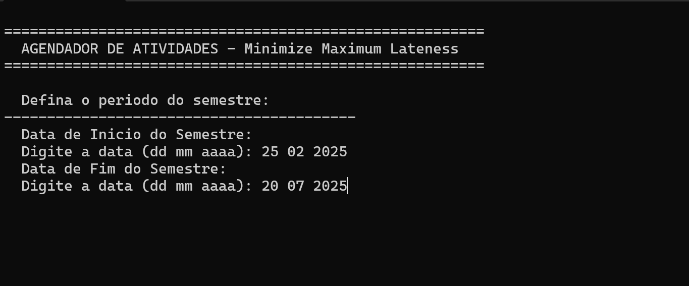

# 🔍 Projeto de Algoritmos Ambiciosos

**Número da Lista:** X (Preencha com o número da sua lista, se houver)

**Conteúdo da Disciplina:** Greed - Scheduling, Partitioning, Knapsack, Coin Change, BreakPoints, A*

## 👨‍🏫 Alunos

| Matrícula   | Aluno           |
|-------------|-----------------|
| 202045482   | [Genilson Silva](https://github.com/GenilsonJrs)   |
| 222022064   | [Carlos Eduardo](https://github.com/dudupaz)   |

---

## 📋 Sobre

Este trabalho tem como objetivo implementar a lógica de Algoritmos Ambiciosos, de forma visual e interativa, utilizando algoritmo de estudo da disciplina.

Este projeto busca reforçar conceitos teóricos de algoritmos ambiciosos (`Greed`) com uma visualização prática e didática. Especificamente, implementamos um **agendador de atividades** que utilizado para **minimizar o atraso máximo (Minimize Maximum Lateness)** de um conjunto de tarefas. O programa permite ao usuário cadastrar atividades com suas durações e datas de prazo, e então calcula a agenda otimizada, exibindo os tempos de início, fim e o atraso de cada tarefa.

---

## 🖼️ Screenshots

<p align="center">Figura 1 - Definição do Período do Semestre</p>

<p align="center">
  
</p>

<p align="center">Figura 2 - Entrada da Quantidade de Atividades</p>

<p align="center">
  
</p>

<p align="center">Figura 3 - Cadastro da Atividade 1</p>

<p align="center">
  
</p>

<p align="center">Figura 4 - Cadastro de Todas Atividades</p>

<p align="center">
  
</p>

<p align="center">Figura 5 - Agenda Final e Resultados</p>

<p align="center">
  
</p>

<p align="center" style="font-size: 14px;">
  Autores: <a href="https://github.com/dudupaz" target="_blank">Carlos Paz</a>,
  <a href="https://github.com/GenilsonJrs" target="_blank">Genilson Silva</a>

</p>

---

### 🎥 Vídeo de Apresentação

Neste vídeo, apresentamos o trabalho desenvolvido, abordando os principais pontos desenvolvidos ao longo do projeto.

[Assista no Youtube]()

---

### ✅ Pré-requisitos

- Sistema operacional: **Windows ou Linux**
- **Compilador C** (Ex: GCC, MinGW no Windows)
- Terminal compatível com comandos do sistema

---

## ⚙️ Instalação e Execução

**Linguagem:** C
**Framework:** Nenhum (Utiliza apenas bibliotecas padrão C)

1.  **Clone o repositório:**

    ```bash
    https://github.com/projeto-de-algoritmos-2025/Greed_CG_Code.git
    ```

2.  **Entre na pasta do projeto:**

    ```bash
    cd Greed_CG_Code
    ```

3.  **Compile o código (Windows ou Linux):**

    * **No Linux/macOS:**
        ```bash
        gcc main.c -o agendador
        ```
    * **No Windows (usando MinGW/GCC):**
        ```bash
        gcc main.c -o agendador.exe
        ```

4.  **Execute o programa:**

    * **No Linux/macOS:**
        ```bash
        ./agendador
        ```
    * **No Windows:**
        ```bash
        agendador.exe
        ```

---

## ▶️ Uso

Após executar o programa, siga as instruções no terminal para definir o período do semestre, cadastrar as atividades com seus nomes, datas de deadline e durações. O programa então processará as informações e exibirá a agenda otimizada com os resultados.

---

## 🧠 Outros

- O projeto foi planejado de forma a demonstrar **visualmente** o comportamento do Algoritmo Ambicioso (**Minimize Maximum Lateness**) na otimização do agendamento de tarefas.
- Este algoritmo é fundamental para **minimizar o atraso máximo (Minimize Maximum Lateness)** de um conjunto de tarefas, garantindo que a tarefa com o prazo mais próximo seja sempre a primeira a ser executada.
- Este algoritmo é amplamente utilizado em sistemas de tempo real e gerenciamento de projetos onde o cumprimento de prazos é crítico.
- O código é implementado em C puro, utilizando apenas bibliotecas padrão, o que o torna leve e eficiente.
- A clareza da saída no terminal foi priorizada para facilitar a compreensão do agendamento e dos resultados.
- O código está comentado para explicar cada etapa do processo de agendamento e o cálculo do atraso.